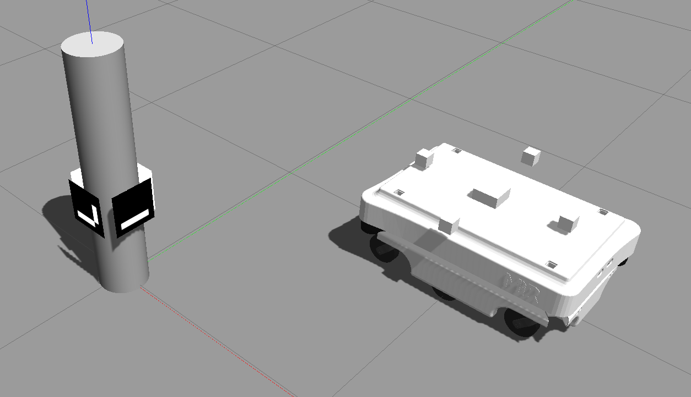

# FRA532 Mobile Robot Exam1




## **Installation**
Clone the repository and install the dependencies:
```bash
git clone https://github.com/SUNTADTAWAN/Mobile-Robot-Exam.git
```

## **Dependencies**
Ensure the following ROS 2 packages are installed:
```bash
sudo apt install ros-humble-robot-localization ros-humble-cv-bridge ros-humble-image-transport
```

## **Nodes Overview**
### **1. `aruco_detect.py`**
**Function:**  
- Detects ArUco markers from the camera feed.  
- Computes the relative position of the marker in the camera frame (`rear_link`, `front_link`, etc.).  
- Publishes marker pose data.  

**Input Topics:**  
- `/camera/image_raw` (Camera feed)  

**Output Topics:**  
- `/aruco_marker_pose` (Marker position relative to the camera)  

---

### **2. `ArucoPoseChecker.py`**
**Function:**  
- Compares the ArUco marker pose with the odometry pose.  
- Helps debug discrepancies between ArUco-based localization and wheel odometry.  

**Input Topics:**  
- `/aruco_marker_pose`  
- `/odom`  

**Output:**  
- Error log comparing the ArUco pose with odometry  

---

### **3. `ArucoPoseTransformer.py`**
**Function:**  
- Transforms the ArUco marker pose from the camera frame (`rear_link`) to the robot's frame (`base_footprint`).  
- Uses `tf2_ros` to perform coordinate transformations.  

**Input Topics:**  
- `/aruco_marker_pose`  

**Output Topics:**  
- `/aruco_marker_pose_base` (Marker position relative to `base_footprint`)  

---

### **4. `imu_odometry.py`**
**Function:**  
- Computes odometry using IMU data (acceleration and angular velocity).  
- Integrates acceleration to estimate velocity and position.  
- Publishes odometry data and TF transforms.  
- Uses a complementary filter to reduce drift.  

**Input Topics:**  
- `/imu_data/data` (IMU sensor readings)  

**Output Topics:**  
- `/odom_imu` (Odometry computed from IMU)  
- TF (`odom → base_footprint`)  

---

### **5. `wheel_odometry.py`**
**Function:**  
- Computes odometry using wheel encoders based on a differential drive model.  
- Estimates robot position (`x, y, θ`) and velocity (`vx, vy, ω`).  
- Publishes odometry data and TF transforms.  

**Input Topics:**  
- `/wheel_encoder` (Wheel velocity data)  

**Output Topics:**  
- `/odom` (Odometry computed from wheel encoders)  
- TF (`odom → base_footprint`)  

---

### **6. `localization.py`**
**Function:**  
- Runs the Extended Kalman Filter (EKF) using the `robot_localization` package.  
- Fuses wheel odometry, IMU data, and ArUco-based localization.  
- Outputs a filtered odometry estimate with reduced noise and drift.  

**Input Topics:**  
- `/odom` (Wheel odometry)  
- `/imu_data/data` (IMU data)  
- `/aruco_marker_pose_base` (Aruco-based localization)  

**Output Topics:**  
- `/odometry/filtered` (Fused odometry from EKF)  
- TF (`odom → base_footprint`)  

---

## **How to Run**
### **1. `Start the Simulation (Gazebo)`**
```bash
ros2 launch fra532_exam1 world.launch.py
```

### **2. ` Run Odometry Nodes`**
```bash
ros2 run fra532_exam1 wheel_odometry.py
ros2 run fra532_exam1 imu_odometry.py
```

### **3. `Run ArUco Detection`**
```bash
ros2 run fra532_exam1 aruco_detect.py
ros2 run fra532_exam1 ArucoPoseTransformer.py
```

### **3. `Run EKF Localization`**
```bash
ros2 launch fra532_exam1 ekf_localization.launch.py
```

### Test

### **1. `Aruco Tracking`**
<video width="600" controls>
  <source src="media/aruco_pos_video.mp4" type="video/mp4">
</video>
